# Flexbox

## Table of Contents

1. [Introduction](#flexbox-intro)
2. [Flex Container &amp; Flex Items](#flex-container-and-flex-items)
3. [Immediate Child Only](#immediate-child-only)
4. [Flexbox Axes](#flexbox-axes)
5. [Flexbox Module](#flexbox-module)
6. [Parent Properties](#parent-properties)
7. [Display](#display)
8. [block vs inline](#block-vs-inline)
9. [flex-direction](#flex-direction)
10. [flex-wrap](#flex-wrap)
11. [flex-flow](#flex-flow)
12. [justify-content [row]](#justify-content-row)
13. [justify-content [column]](#justify-content-column)
14. [space-around vs space-evenly](#space-around-vs-space-evenly)
15. [align-items [row]](#align-items-row)
16. [baseline](#baseline)
17. [align-items [column]](#align-items-column)
18. [align-content](#align-content)
19. [Child Properties](#child-properties)
20. [order](#order)
21. [flex-grow](#flex-grow)
22. [flex-grow calculation](#flex-grow-calculation)
23. [flex-shrink](#flex-shrink)
24. [flex-shrink calculation](#flex-shrink-calculation)
25. [flex-basis](#flex-basis)
26. [flex-basis vs widths](#flex-basis-vs-widths)
27. [flex](#flex)
28. [align-self](#align-self)
29. [Flexbox Properties](#flexbox-properties)
30. [Flexbox Cheatsheet](#flexbox-cheatsheet)
31. [Aligning with Auto Margins](#bonus-aligning-with-auto-margins)

## #flexbox-intro

### CSS Flex Box

The CSS flexbox is used to make the elements behave predictably when they are used with different screen sizes and different display devices. It provides a more efficient way to layout, align and distribute space among items in the container.

It is mainly used to make CSS3 capable to change its item?s width and height to best fit for all available spaces. It is preferred over block model.

The CSS3 flexbox contains flex containers and flex items.

---

## #flex-container-and-flex-items

### Flex Conatainer (Parent Element)

This is a flex container (the blue area) with three flex items:


The flex container becomes flexible by setting the `display` property to `flex`:

###### Example :

```css
.flex-container {
  display: flex;
}
```

The flex container properties are:

- `flex-direction`
- `flex-wrap`
- `flex-flow`
- `justify-content`
- `align-items`
- `align-content`

---

### Flex Item(Child Elements)

The direct child elements of a flex container automatically becomes flexible (flex) items.

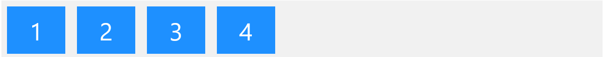

The element above represents four blue flex items inside a grey flex container.

```html
<div class="flex-container">
  <div>1</div>
  <div>2</div>
  <div>3</div>
  <div>4</div>
</div>
```

The flex item properties are:

- `order`
- `flex-grow`
- `flex-shrink`
- `flex-basis`
- `flex`
- `align-self`

---

## #immediate-child-only

### What is CSS immediate child?

The CSS child combinator `(>)` can be used to select all elements that are the immediate children of a specified element.

A combinator combines and explains the relationship between two or more selectors

One VERY important thing I want to point out is that the flex container only wraps around its immediate children. The flex container doesn't wrap beyond one layer deep. Only the immediate children. So there is NOT a grandchildren or grand-grandchildren relationship. Only Parent ↔️ Immediate Children!

Of course, you can establish a Flexbox as long as there is a parent-child relationship. So a child can also be the flex container to its children. But it will be a separate flex container. And it doesn't carry over the grandparent flex properties.

This is probably one of the most important concepts that helped me understand how Flexbox works. And knowing this will help solve a lot of those "hey, why isn't this working" moments 😅

### Syntax

```css

selector1 > selector2 { style properties }

```

It matches only those elements matched by the second selector (`selector2`) that are the direct children of elements matched by the first selector (`selector1`).

### Example

In this example, add a background-color property to all the immediate child (`p`) elements of the parent (`div`) element.

```html
<div>
  <p>1. Immeditate child.</p>
  <p>2. Immeditate child.</p>
  <section><p>3. Not immeditate child.</p></section>
  <!-- not Child but Descendant -->
  <p>4. Immeditate child.</p>
</div>
```

```css
/* p elements that are immediate
   children of div elements */
div > p {
  background-color: plum;
}
```

### Output

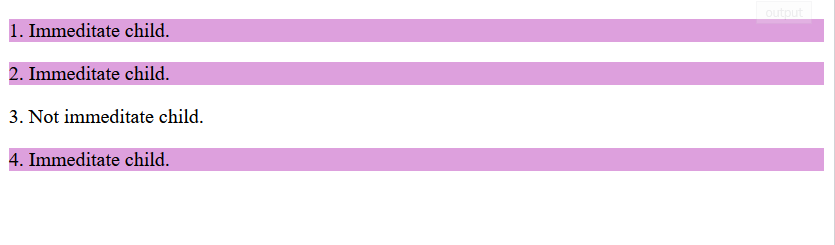

### Notice\*

Notice that the CSS property does not apply to the third p element as it is not an immediate child.

---

## Flexbox Axes

## #flexbox-axes

Flexbox operates in a 2 axes system: a main and a cross axis. The main axis is your defining direction of how your flex items are placed in the flex container. Determining the cross axis is very simple, it's in the direction that's perpendicular to your main axis.

CSS flexbox axes works on a vertical(cross-axes) and horizontal(main-axes) when coders need to move items around in their project. The code needed to work along the main-axes is “justify-content: {direction of the content}” and the cross axes code is “align-items: { direction of content }”.

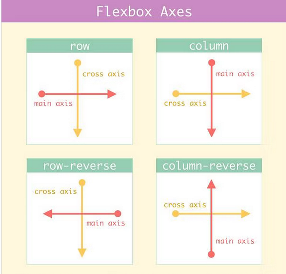

### Example 1

In the example below, is flex box axes in action. Let say that you have square blocks of code as your items and your trying to determine how the justify-content on the main-axes. Using the “justify-content: flex-start”, begins on the main axes at the top of the page starting with block “one”.

```html
<div class="box">
  <div>one</div>
  <div>two</div>
</div>
```

```css
.box {
  display: flex;
  flex-direction: column;
  justify-content: flex-start;
  align-items: center;
  height: 500px;
  border: 2px solid rgb(96, 139, 100);
}
```

### Output

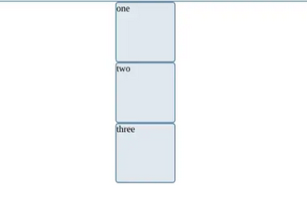

### Example 2

In the example below, is flex box axes in action. Let say that you have square blocks of code as your items and your trying to determine how the justify-content on the main-axes. Using the “justify-content: flex-start”, begins on the main axes at the top of the page starting with block “one”.

```html
<div class="box">
  <div>one</div>
  <div>two</div>
</div>
```

```css
.box {
  display: flex;
  flex-direction: column;
  justify-content: center;
  align-items: center;
  height: 500px;
  border: 2px solid rgb(96, 139, 100);
}
```

### Output

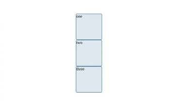

The “align-items:{direction of content}” have the same concept as the justify-content property but the difference is the align-items property works on cross-axes. For example, in the display below..if you wrote the “align-items: left”, this would push the items on the screen all the way to the left end to the width box.

```html
<div class="box">
  <div>one</div>
  <div>two</div>
</div>
```

```css
.box {
  display: flex;
  flex-direction: column;
  justify-content: center;
  align-items: left;
  height: 500px;
  border: 2px solid rgb(96, 139, 100);
}
```

### Output

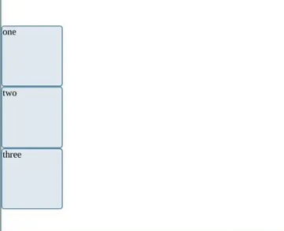

Here in example #2, if you were to rewrite the code above and change to “align-items: center”, this would push the items to the center of the page.

```html
<div class="box">
  <div>one</div>
  <div>two</div>
</div>
```

```css
.box {
  display: flex;
  flex-direction: column;
  justify-content: center;
  align-items: center;
  height: 500px;
  border: 2px solid rgb(96, 139, 100);
}
```

### Output

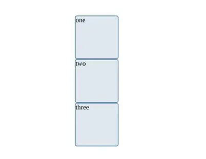

Overall the flexbox axes allows you move items using the “justify-content” (main-axes) or the “align-items” (cross-axes) property. Using these two properties can make the CSS3 experience rich when designing and creating a unique application.

## Flexbox Module

### flexbox-module

##### What is it?:

The Flexbox Module refers to the concept that when we apply the property, display:flex; to an element, we're not just flexing the display but also gaining access to a collection of properties we can apply. These properties are awesome and “provide a more efficient way to lay out, align and distribute space among items in a container, even when their size is unknown and/or dynamic (thus the word “flex”).”

#### Why is it important?:

Flexbox is important because it provides a dynamic way to style our pages. No more calculating widths, heights or manually positioning objects.

Flexbox provides the tools to tackle almost any positioning problem. Occasionally, you’ll have to rely on a few custom positioning styles, but for most layout objectives Flexbox has got your back!

## Parent Properties

### #parent-properties

The flex container properties are:

- `flex-direction`
- `flex-wrap`
- `flex-flow`
- `justify-content`
- `align-items`
- `align-content`.

## Display

### #display

To start this Flexbox , we need to first create our flex container. This is done by applying flex to the display property on the parent element. Bam! Now all its immediate children will become flex items.

#### There are 2 types of flex container:

flex will create a block level flex container, and inline-flex will create an inline level flex container. More on block and inline in the next post 😉

## block vs inline

### #block-vs-inline

Very simply explained, block element takes up the entire width of the container. They look like building blocks where each block is stacked on each other. Whereas inline element only takes up the space it needs. So they appear to be in a line, or side by side of each other.

### Block

```css
div {
  display: block;
}
```

#### Output

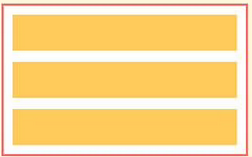

### Inline

```css
div {
  display: inline;
}
```

#### Output

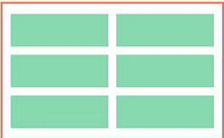

## Flex direction

The `flex-direction` property defines in which direction the container wants to stack the flex items.

This is the property that allows us to define our main axis. Remember I mentioned that our main axis can be horizontal or vertical. So if we want the main axis to be horizontal, that's called row. And if we want it to be vertical, that's called column. Also, remember we had a main start and main end. We simply add a reverse suffix to set our "main start" in the reverse direction.

```css
.parent {
  flex-direction: row /* default */
               or row-reverse
               or column
               or column-reverse
}
```

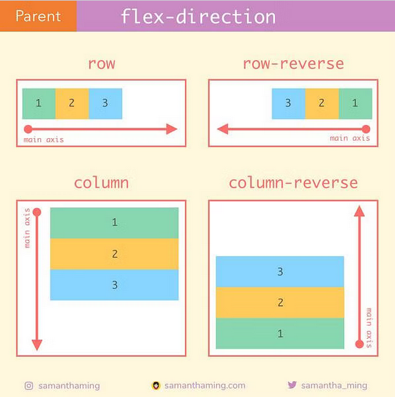

## Flex-Wrap

The `flex-wrap` property specifies whether the flex items should wrap or not.

By default, flex items will try to shrink itself to fit onto one line, in other words, no wrap. However if you want the flex items to maintain its size and have the overflow spread on multiple lines in the containers, then you can turn on wrap.

This property is what will allow flex items in your container to occupy more than one line.

```css
.parent {

  flex-wrap: nowrap /* default */
          or wrap
          or wrap-reverse
}

```

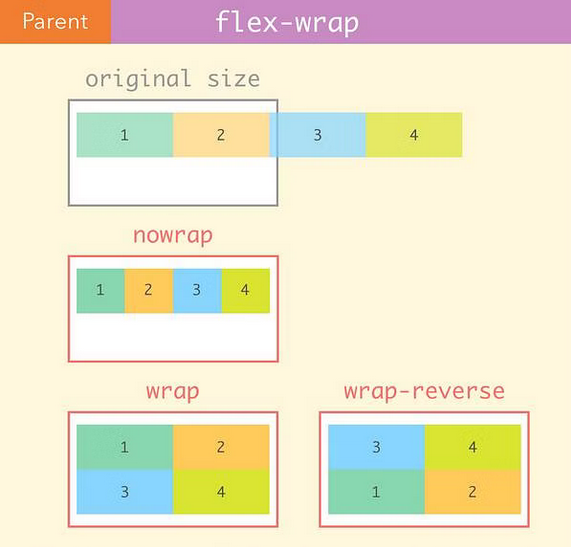

## flex-flow

The flex-flow property is a shorthand property for setting both the flex-direction and flex-wrap properties.

Example

```css
.flex-container {
  display: flex;
  flex-flow: row wrap;
} 
```
## justify-content [row]

Defines how flexbox/grid items are aligned according to the main axis, within a flexbox/grid container.

`justify-content: flex-start;`

The flexbox items are pushed towards the start of the container's main axis.

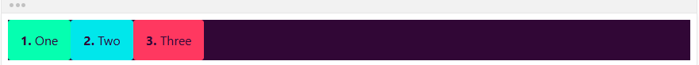

`justify-content: flex-end;`

The flexbox items are pushed towards the end of the container's main axis.

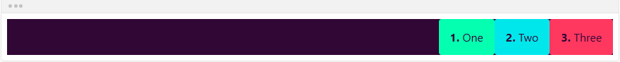

`justify-content: center;`

The flexbox items are centered along the container's main axis.

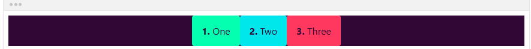

`justify-content: space-between;`

The remaining space is distributed between the flexbox items.

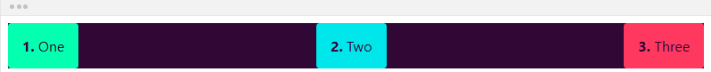

`justify-content: space-around;`

The remaining space is distributed around the flexbox items: this adds space before the first item and after the last one.

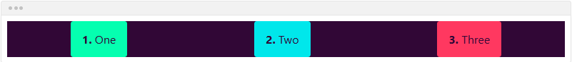


## justify-content [column]

The main axis can also lie vertically. In that case, flex-direction is set to column. Here's how the flex items will be aligned in that instance.

```css
.parent {
  flex-direction: column;

  justify-content: flex-start /* default */
                or flex-end
                or center
                or space-around
                or space-between
                or space-evenly
}
```

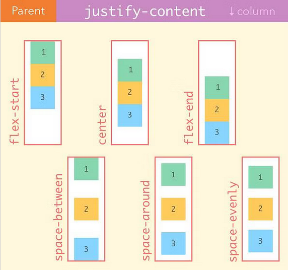

## space-around vs space-evenly

(#space-around-vs-space-evenly)

You might not notice the subtle difference between space-around and space-evenly. So let's talk about it. In space-evenly, the empty space in between the flex items is always equal. However, in space-around, only the inner items will have equal spacing in between each other. The first and last item will only be allocated half the spacing.

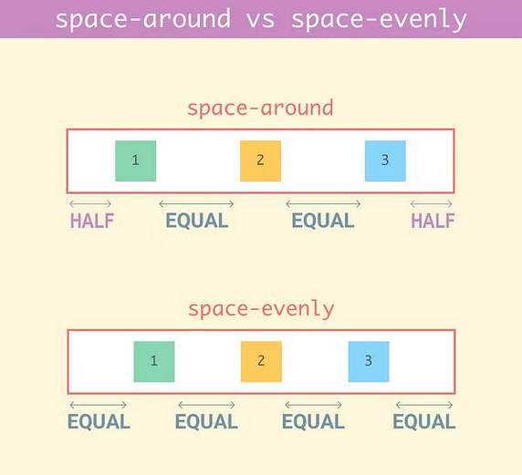


